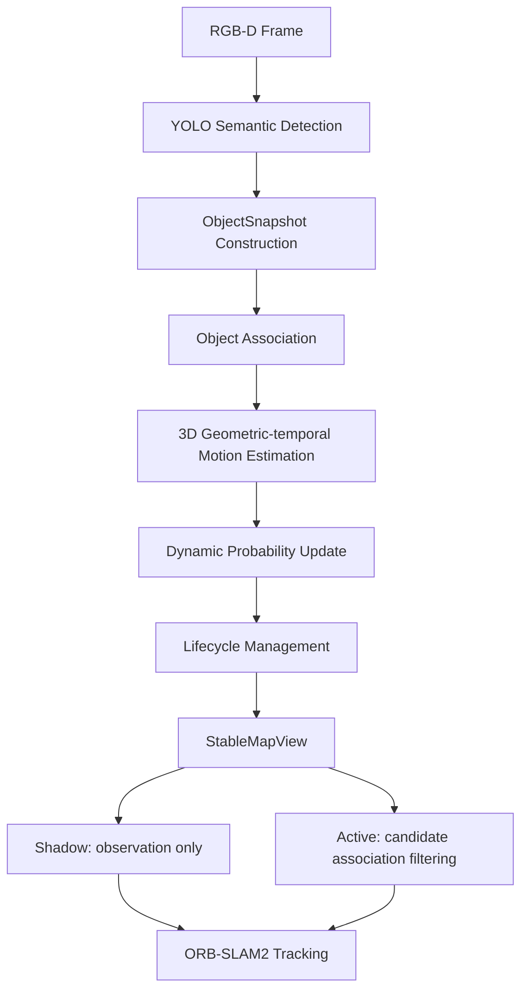

# 3 基于目标级时间一致性的动态场景 RGB-D SLAM 方法

## 3.1 系统总体框架

本文在 ORB-SLAM2 与已有语义检测流程之外构建独立的 ObjectDynamic 层。系统将当前 RGB-D 帧、相机位姿、语义检测框及其关联地图点复制为值语义快照，依次完成跨帧目标关联、三维运动估计、动态概率更新和生命周期管理，最终形成 `StableMapView`。ObjectDynamic 不持有 `Frame`、`KeyFrame` 或 `MapPoint` 裸指针，因此对象状态与原 SLAM 地图对象的所有权相互隔离。

该设计的基本思想是：语义类别提供对象的初始动态倾向，连续有效的几何与时间观测决定概率后续演化，单帧类别判断不直接等价于最终动态状态。

## 3.2 ObjectSnapshot 与目标观测

Tracking 在成功跟踪结束后构造 `ObjectSnapshot`。快照包含帧编号、时间戳和相机位姿；每个 `SnapshotDetection` 包含类别编号、类别名称、二维边界框、检测置信度、三维位置、`position_valid` 以及边界框内关联的 MapPoint ID。快照仅保存数值，不保存 ORB-SLAM2 内部对象引用。

当前实现以检测框中心像素的深度进行反投影。设边界框为

\[
B=(l,t,r,b),\qquad u_c=\frac{l+r}{2},\quad v_c=\frac{t+b}{2}.
\]

当中心像素位于深度图范围内且深度 \(z_c>0\) 时，根据相机内参得到相机坐标，再利用当前相机位姿转换到世界坐标，形成对象位置 \(\mathbf p_t\)。当前实现没有使用框内深度中值、深度聚类或目标三维包围盒，因此论文不将其描述为鲁棒三维中心估计。

### 3.2.1 `position_valid` 机制

若中心像素越界、深度不大于零或反投影结果维度异常，则 `position_valid=false`。此时结构体中的默认零向量只是占位值，不表示有效世界原点，并遵循以下规则：

1. 目标关联不使用三维距离项；
2. MotionEstimator 返回 `InvalidPosition`，不计算速度，不更新运动分数与动态概率；
3. 有效的 \((0,0,0)\) 与无效零占位由 `position_valid` 明确区分。

## 3.3 多特征目标关联

目标关联联合语义类别、二维交并比、图像中心距离和三维位置距离。各代价定义为

\[
C_{sem}=\begin{cases}0,&c_i=c_j\\1,&c_i\ne c_j,\end{cases}
\]

\[
C_{iou}=1-\operatorname{IoU}(B_i,B_j),
\]

\[
C_{2D}=\operatorname{clip}_{[0,1]}\left(\frac{\|\mathbf u_i-\mathbf u_j\|_2}{100}\right),
\]

\[
C_{3D}=\operatorname{clip}_{[0,1]}\left(\frac{\|\mathbf p_i-\mathbf p_j\|_2}{2.0}\right).
\]

当两侧三维位置均有效时，总代价为

\[
C=0.35C_{sem}+0.30C_{iou}+0.15C_{2D}+0.20C_{3D}.
\]

当任一侧三维位置无效时，三维项被移除，其余权重重新归一化：

\[
C=\frac{0.35C_{sem}+0.30C_{iou}+0.15C_{2D}}{0.35+0.30+0.15}.
\]

代码保留一般形式的权重和除数计算。仅保留 \(C\leq0.70\) 的候选对，然后按代价升序执行一对一贪心匹配。成功匹配沿用已有 object ID；未匹配检测创建新 ID；未匹配历史对象进入 Lost。

## 3.4 几何—时间运动估计

对于连续匹配且三维位置有效的同一对象，速度为

\[
\mathbf v_t=\frac{\mathbf p_t-\mathbf p_{t-1}}{\Delta t},
\qquad \Delta t=t_t-t_{t-1}.
\]

实现只接受 \(10^{-6}<\Delta t\leq10\) s。速度幅值评分为

\[
S_v=1-\exp\left(-\frac{\|\mathbf v_t\|_2}{0.5}\right).
\]

若已有非零历史速度，则方向一致性由当前与历史速度方向计算，历史稳定性为

\[
S_h=\exp\left(-\frac{\|\mathbf v_t-\mathbf v_{t-1}\|_2}{0.5}\right).
\]

方向一致性和历史稳定性以0.5/0.5加权：

\[
S_c=\frac{0.5S_d+0.5S_h}{0.5+0.5}.
\]

没有非零历史速度时，两项均取中性值1。几何运动评分为

\[
S_{geo}=\operatorname{clip}_{[0,1]}(S_vS_c).
\]

post-P0 实现的最终运动评分严格为

\[
\boxed{S_{motion}=S_{geo}}.
\]

语义先验不再作为每帧运动分数的固定加项，不采用 \(0.5S_{geo}+0.5S_{sem}\)。

## 3.5 语义初始化与动态概率更新

对象创建时初始化为 PotentialDynamic。person 类别在当前工程中的 `class_id=3`，其初始概率为

\[
P_0=0.7,
\]

其他类别为

\[
P_0=0.5.
\]

语义在这里表达初始动态倾向，而不是持续注入运动证据。每次有效运动估计后采用指数平滑：

\[
\boxed{P_t=0.8P_{t-1}+0.2S_{motion}}.
\]

因此，具有持续运动证据的对象概率上升；连续缺乏几何运动证据时，即使是 person，其概率也会逐步下降。例如静止 person 的理论序列为 \(0.7\rightarrow0.56\rightarrow0.448\)，不会仅由类别长期锁定为 Dynamic。若三维位置或时间间隔无效，本次运动估计不成立，代码保持当前概率，不制造零速度证据。

## 3.6 在线生命周期管理

生命周期包括 Static、PotentialDynamic、Dynamic、Lost 和 Recovered。默认阈值为静态阈值0.30、候选阈值0.50、通用动态阈值0.70；person 的进入 Dynamic 阈值为0.60。

- 新对象：初始化为 PotentialDynamic。
- Static：当 \(P\geq0.50\) 时进入 PotentialDynamic。
- PotentialDynamic：person 在 \(P\geq0.60\) 时进入 Dynamic，其他类别在 \(P\geq0.70\) 时进入 Dynamic；当 \(P\leq0.30\) 时进入 Static。
- Dynamic：当 \(P<0.50\) 时退回 PotentialDynamic。
- 任一未观测对象：进入 Lost，同时清零部分恢复计数。
- Lost 重新匹配：Adapter 保持其 Lost 状态并在线调用 `RecoverObject()`；连续第1、2次匹配只累计恢复确认，连续第3次匹配后进入 Recovered。中途再次丢失会清零确认计数。
- Recovered：第三次确认所在帧保留为 Recovered；下一次有效观测按当前概率进入 Dynamic、Static 或 PotentialDynamic。

由此，在线真实路径为

\[
Lost\rightarrow Recovery(1)\rightarrow Recovery(2)\rightarrow Recovered
\rightarrow\{Static,PotentialDynamic,Dynamic\}.
\]

其中 `recovery_confirmation_frames=3`，第三个重新匹配帧完成确认。该机制强调“单帧检测结果不等于最终动态状态”。

## 3.7 StableMapView 与两种使用模式

`StableMapView` 保存当前帧编号、时间戳、快照接受状态、active objects、dynamic objects 和 recovered objects。Dynamic 对象是 active objects 中生命周期为 Dynamic 的子集。

Shadow 模式调用完整 ObjectDynamic 流程并生成 `StableMapView`，但不将结果反馈给 Tracking 的匹配、位姿优化或地图结构，只用于状态观测与统计。

Active 模式首先用 `StableMapView` 更新 `DynamicMapFilter`，然后在 `TrackLocalMap()` 中执行三处候选过滤：函数开始时清除当前帧已有的动态 MapPoint 关联；`UpdateLocalMap()` 后从局部地图候选列表排除动态点；`SearchLocalPoints()` 后、位姿优化前再次进行防御性过滤。该行为应表述为“过滤当前 Tracking 关联和抑制局部候选”，而不是“删除动态地图点”。代码不调用 `MapPoint::SetBadFlag()`，不删除 MapPoint，也不删除 KeyFrame 观测或改变 Paper1 证据。

